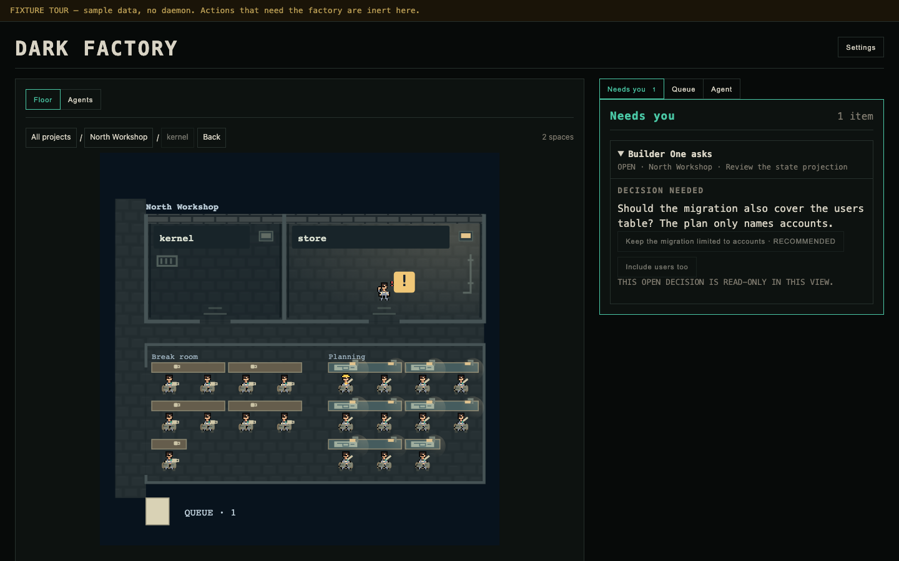

# Dark Factory

**An autonomous software factory you can see and steer.** Give your coding
agents work. Let an overseer coordinate them. Watch the live floor, inspect
results, and step in when decisions need you.

<picture>
  <source media="(max-width: 600px)" srcset="docs/assets/factory-floor-demo-mobile.png">
  
</picture>

*Demo data in the actual console: sample workers on the floor and a synthetic
Needs You decision. No daemon is connected.*

Keep work moving across projects: queue and prioritize tasks, let an overseer
follow up, inspect results, and decide when work needs your judgment. Workers
leave reviewable results, the Maintainer publishes approved work through the
configured GitHub route, and the paired browser and `factoryctl` steer the
same factory.

[Website](https://www.darkfactory.build) · [Console (paired factory)](https://app.darkfactory.build) ·
[Backlog](https://github.com/dark-factory-build/dark-factory/issues) ·
[Install](docs/install.md) · [Providers](docs/providers.md) ·
[Architecture](ARCHITECTURE.md) · [Security](SECURITY.md)

## What you can do

- Close the browser and the factory keeps its queue and running work alive while the host Mac stays awake.
- Give a task to a named worker or let the next available worker take it.
- Let an overseer turn a goal into follow-up work and coordinate the workers.
- Open a live terminal, read a Needs You request, and decide when to step in.
- Inspect a completed result, send it back with feedback, or take it forward for review.
- Pair a phone to watch and direct the same factory away from the Mac.

## How work moves

Choose a checkout, describe the outcome, add workers with accounts on the
machine, then queue work. Dark Factory makes an isolated worktree and starts
the selected provider. The floor shows workers and tasks. Needs You requests
decisions; otherwise the overseer continues. Review completed changes, send
them back, or let the Maintainer publish them.

## Requirements and quick start

Use the **next release containing this CLI**; its version is not selected.
It requires macOS, Git, and `factoryd`, `factory-runner`, and `factoryctl` on
`PATH`. A Codex worker requires a signed-in `codex` CLI on `PATH`. Providers
receive repository and task material; read [provider support](docs/providers.md).

Install that release with the [installation guide](docs/install.md), initialise
a home, and start its service. These commands use its socket
and token:

```sh
factoryctl init --home "$HOME/.dark-factory"
factoryctl service install --home "$HOME/.dark-factory"
factoryctl service status --home "$HOME/.dark-factory"
export DARK_FACTORY_SOCKET="$HOME/.dark-factory/runtimes/factory.sock"
export DARK_FACTORY_OPERATOR_TOKEN_FILE="$HOME/.dark-factory/operator.token"
factoryctl dispatch on
factoryctl web status
factoryctl web open
```

From an existing committed Git checkout, `project create` prints `PROJECT_ID`;
`agent create` prints `AGENT_ID`. Give the worker a bounded first outcome, then
inspect it on the floor or paired console:

```sh
factoryctl project create --name "My project" --root "$PWD"
factoryctl agent create --project PROJECT_ID --name builder \
  --provider codex --tool-budget 100
factoryctl task add --project PROJECT_ID --agent AGENT_ID \
  --title "Improve one documented setup step" \
  --body "Read README.md and the project layout. Correct one concise setup or contributor instruction supported by the code, run git diff --check, and report the files changed."
```

Use `factoryctl account discover` or `account list` to inspect a Codex login.
For another checkout, `project repository add --id HEX32 --project PROJECT_ID
--name NAME --root ABSOLUTE --base REF` returns the revision needed to set its
default; a named task keeps its explicit repository.

The local candidate checked packaging, a shell attempt, routing, and restart
recovery. Live Codex, GitHub access, and publication remain release gates.
Issue intake and managed setup ship with the same next release. More
in the [development workflow](docs/development/WORKFLOW.md).

Dark Factory is MIT licensed.
