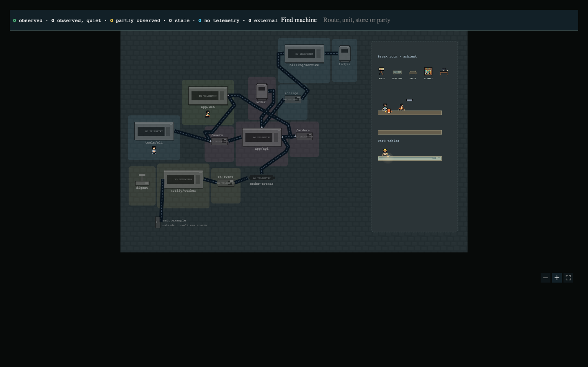

# Dark Factory

**An autonomous software factory you can see and steer.**

Give your coding agents work. Let an overseer coordinate them. Watch progress
on a live factory floor, inspect results, and step in when they need a decision.
Keep parallel work in one place instead of juggling separate agent sessions.

<picture>
  <source media="(max-width: 600px)" srcset="docs/assets/factory-floor-demo-mobile.png">
  
</picture>

*The console with labelled demo data and no daemon connected. This capture
predates the operational floor, where each hall is one deployment unit of your
software and workers stand at the machines their changes touch; see [the
operational factory](docs/development/OPERATIONAL_FACTORY.md).*

[Get started](#install) · [Website](https://www.darkfactory.build) ·
[Console (requires pairing)](https://app.darkfactory.build) ·
[Documentation](docs/install.md) · [Community backlog](https://www.darkfactory.build/backlog)

## What you can do

- **See the work.** The floor pictures your software as a plant: each hall is a deployment unit, its machines are routes, jobs and stores, and a worker walks to the part its change touches. Select a worker to see its activity.
- **Coordinate a team.** Let an overseer break down goals, assign workers, and follow up on their results.
- **Keep work moving.** Queue and prioritize work across projects and repositories. Assign a named agent or the next available worker.
- **Stay in control.** Open agent terminals, send instructions, and answer Needs You decisions from the same console.
- **Review and improve.** Inspect completed work and review findings, request corrections, and publish reviewed pull requests when GitHub is configured.
- **Contain the work.** Every worker attempt gets its own Git worktree, and every attempt gets a private runtime home and temp directory. Codex and Claude Code commands run in an OS sandbox whose only writable places are those, the repository's Git directory (read-only for an overseer), and the shared local CI lease when one exists. Inside your home directory it can read only what the factory granted it, such as those places and the configured toolchain.
- **Set the budget.** Cap a project by runs and by recorded provider tokens: at either ceiling it admits nothing new and running work finishes. Cap each run's wall-clock time: a run that passes it is cancelled.
- **Choose the model per worker.** Codex and Claude Code workers share one floor, each with its own provider, model and effort.
- **Step away from the browser.** Work continues while your Mac stays awake. With remote access configured, a paired phone can steer the same factory.

## Requirements

- macOS on Apple silicon or Intel. The runtime is macOS-only.
- Git, and an existing committed Git checkout to work on.
- For model-backed workers, the `codex` or `claude` CLI installed and already
  signed in. The `shell` provider needs neither and runs its task as a script.
- A browser for the console.
- Building from source needs Go (the version in [go.mod](go.mod)). Console
  development needs only Node 22 or later with Corepack; see
  [Contributing](CONTRIBUTING.md).

## Install

[Install the latest release](docs/install.md#install-a-release) with its three
commands on `PATH`, then create and start one managed home:

```sh
factoryctl init --home "$HOME/.dark-factory"
factoryctl service install --home "$HOME/.dark-factory"
```

A fresh installation opens the console in your default browser, already
paired. If you lose every paired browser, `factoryctl web pair` opens your
default browser already paired; see [installation](docs/install.md).

## Your first task

Every command below talks to the daemon over its local socket, authenticated
by the operator token file in the home. For the default home `~/.dark-factory`
they find both without configuration; for another home, export
`DARK_FACTORY_SOCKET` and `DARK_FACTORY_OPERATOR_TOKEN_FILE` first.

```sh
factoryctl dispatch on
factoryctl project create --name "My project" --root "$PWD"
factoryctl agent create --project PROJECT_ID --name builder --provider codex --tool-budget 100
factoryctl task add --project PROJECT_ID --agent AGENT_ID \
  --title "Fix one setup instruction" \
  --body "Correct one setup instruction in README.md that the code contradicts, commit it, and report the file changed."
```

Each command prints JSON; copy its `id` into the next. Work is asynchronous:
`task add` only queues it. Poll `factoryctl status` until the task's `status`
is `succeeded`, `failed` or `blocked`, then read its result with the task's
current `revision` from that status:

```sh
factoryctl status
factoryctl task read --task TASK_ID --revision REVISION
```

The `outcome` is the worker's report. Its commits are on a `factory/…` branch
in a private Git directory inside your checkout's `.git`, never on your own
branches; [inspecting a result](docs/install.md#inspect-a-result) shows how to
fetch it. Everything here is also in the console: select **builder** on the
floor to watch its terminal, read the result, and send it back with feedback.
To try the same path without a model or an installed service, see [a task
without a model](docs/install.md#try-a-task-without-a-model).

## Status

With a GitHub connection, factoryd runs accepted issues end to end itself: it
hands each one to a worker, publishes and corrects the pull request, reviews it
and enqueues it; the overseer handles only exceptions. The hosted GitHub
connection for new customers still awaits service activation; manual local
work and the public [reporting page](https://www.darkfactory.build/feedback)
remain available.

Shell and Codex workers and Codex overseers are proven with real work. A Claude
Code worker is proven by one live run; a Claude Code overseer has fixture proof
only, so use a Codex overseer for now. Agents run on your Mac as your user; see
[provider support](docs/providers.md) for the sandbox boundary and token
budgets, and [Security](SECURITY.md) for what it does and does not contain.

## Further reading

[Installation and operation](docs/install.md) · [Architecture](ARCHITECTURE.md) · [Security](SECURITY.md) ·
[Contributing](CONTRIBUTING.md) · [Development](docs/development/WORKFLOW.md) ·
[Deployment](docs/development/DEPLOY.md). Dark Factory is MIT licensed.
